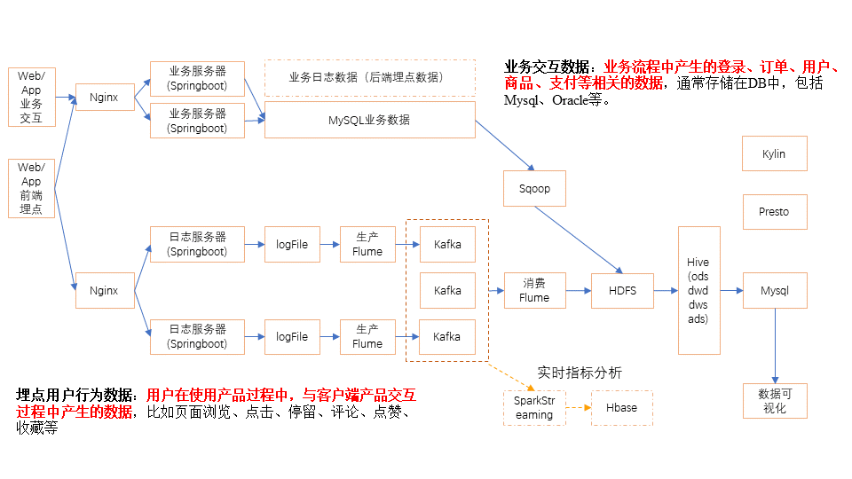

# 一、数据仓库概念

**数据仓库 Data-HouseWare**是为企业==所有决策==制定过程，提供==所有==系统数据支持的==战略==集合。

通过对数据仓库中数据的分析，可以帮助企业，**改进业务流程、控制成本、提高产品质量**等。

数据仓库并不是数据的最终目的地，而是为数据UI中的目的地做好准备。这些准备包括对数据的**清洗、转义、分类、重组、合并、拆分、统计**等等

通过**日志采集系统、业务系统数据库、爬虫系统**等采集数据
数据经过**ETL(数据清洗)**后进入**数据仓库**
狭义的ETL
广义的ETL
数据仓库内的数据最终用途有**报表系统、用户画像、推荐系统、机器学习、风控系统**

# 二、项目需求与架构设计

## 1.1 项目需求分析

### 项目需求
1. 数据**采集平台搭建**
2. 实现**用户行为数据仓库**的**分层搭建**
3. 实现**业务数据仓库**的分层搭建
4. 很对数据仓库中的数据进行**留存、转换率、GMV、复购率、活跃**等**报表分析**

>**留存**
用户留存，网站新增用户数除以访问量即为用户留存率
商品留存，下单总量除以访问量为商品留存率

>**转化率**
从某一渠道多少次访问后留存即为该渠道转化率

>**GMV(总成交额)**
已经付款的金额和未付款的金额总和

>**复购率**
用户在平台(对某个商品)重复购买频率

>**活跃**
用户活跃度，即用户停留时间，登录间隔

## 1.2 项目框架

### 1.2.1 技术选型

>**数据采集传输**
**Flume**，日志
**Kafka**，消息中间件
**Sqoop**，关系型数据库
Logstash，ELK套件类似FLume，在新的大数据公司有广泛引用
DataX，异构数据源同步工具，类似于Sqoop，但是比Sqoop功能强大
*DataX在国内应用广泛

>**数据存储**
**MySQL**
**HDFS**
HBase
Redis，用于缓存用于存放不敏感数据
MongoDB，文档型数据库，自描述数据
*HBase不利于查询，需要使用java代码编写filter，一般HBase和Pheonix搭配使用

>**数据计算**
**Hive**，离线计算
**Tez**，针对mr进行了优化，本质上不是mr模型，mr不支持DAG(有向无边图)，主要用于复杂业务(job之间存在复杂依赖关系)
**Spark**，准实时计算，hive on spark，使用Spark后hql不再转换成mr而是spark程序(内存计算)，速度更快,只有大企业才会使用Spark，小的企业使用Hive就能满足业务需求
Flink，国内有很强的上升趋势
Storm，真正的实时计算，生态环境差，不能通过yarn进行资源调度
*Tez和Spark同时通过yarn进行资源调度

>**数据查询**
**Presto**，
**Druid**，在Kylin的基础上加了时间线
Impala，CDH官方自带
Kylin，与原生Apache搭配使用

### 1.2.2 系统数据流程设计



 * *该图要能够做到手绘，并对每个细节进行叙述*

**高可扩**(双层Flume中间对接Kafka，可以扩展实时指标分析)
对于HDFS中的数据进行分层(ods、dwd、dws、ads)，使用Hive分析

### 1.2.3 框架版本选型

>**Apache**
运维麻烦、组件间兼容需要自己调研
一般时大的企业使用，技术实力雄厚，有专业的运维人员

>**CDH**
国内使用最多的版本，但CM不开源
对中小型企业的使用无影响(推荐使用)

>**HDP**
开源，可以进行二次开发，但是没有CDH稳定，国内使用较少

 * *CDH和HDP已经合并*

| Apache     | Version   |
| :--------- | :-------- |
| **Hadoop** | **2.7.2** |
| **Flume**  | **1.7.0** |
| Kafka      | 0.11.0.2  |
| **Hive**   | **1.2.1** |
| Sqoop      | 1.4.6     |
| MySQL      | 5.6.24    |
| Azkaban    | 2.5.0     |
| Java       | 1.8       |
| ZooKeeper  | 2.4.10    |
| Presto     | 0.189     |

| CDH        | Version   |
| :--------- | :-------- |
| **Hadoop** | **2.6.0** |
| **Spark**  | **1.6.0** |
| **Flume**  | **1.6.0** |
| **Hive**   | **1.1.0** |
| Sqoop      | 1.4.6     |
| Oozie      | 4.1.0     |
| ZooKeeper  | 3.4.5     |
| Impala     | 2.9.0     |

 * *框架选型尽量不要选最新的框架，选择最新框架前半年左右的稳定版。*

### 1.2.4 服务器选型

物理机和云主机的选择

>**机器成本考虑**
**物理机**，以128G内存，20核物理CPU，40线程，8THDD和2TSSD，戴尔品牌单台报价4W出头，需考虑托管服务器费用，一般物理机寿命为5年左右

**云主机**，以阿里云为例，差不多相同配置，每年5W

>**运维成本考虑**
**物理机**，需要有专业的运维人员
**云主机**，很多运维工作都由阿里云完成，运维轻松

### 1.2.5 集群资源规划设计

**集群规模的确定**
<!-- TODO 添加规模确定计算 -->

**测试集群服务器规划**
| 服务名称              | 子服务           | 服务器   hadoop102 | 服务器   hadoop103 | 服务器   hadoop104 |
| --------------------- | ---------------- | ------------------ | ------------------ | ------------------ |
| HDFS                  | NameNode         | √                  |                    |                    |
| DataNode              | √                | √                  | √                  |                    |
| SecondaryNameNode     |                  |                    | √                  |                    |
| Yarn                  | NodeManager      | √                  | √                  | √                  |
| Resourcemanager       |                  | √                  |                    |                    |
| Zookeeper             | Zookeeper Server | √                  | √                  | √                  |
| Flume(采集日志)       | Flume            | √                  | √                  |                    |
| Kafka                 | Kafka            | √                  | √                  | √                  |
| Flume（消费Kafka）    | Flume            |                    |                    | √                  |
| Hive                  | Hive             | √                  |                    |                    |
| MySQL                 | MySQL            | √                  |                    |                    |
| Sqoop                 | Sqoop            | √                  |                    |                    |
| Presto                | Coordinator      | √                  |                    |                    |
| Worker                |                  | √                  | √                  |                    |
| Azkaban               | AzkabanWebServer | √                  |                    |                    |
| AzkabanExecutorServer | √                |                    |                    |                    |
| Druid                 | Druid            | √                  | √                  | √                  |
| 服务数总计            |                  | 13                 | 8                  | 9                  |

>**规划原则**
占内存的进程分开
占磁盘IO的进程分开

# 三、数据生成模块

## 1.埋点数据基本格式

>**公共字段**
基本所有安卓手机都包含的字段

>**业务字段**
埋点上报的字段，有具体的业务类型

**埋点数据示例**
```json
{
    "ap": "xxxxx", //项目数据来源 app pc
    "cm": { //common 公共字段
        "mid": "", // (String) 设备唯一标识
        "uid": "", // (String) 用户标识
        "vc": "1", // (String) versionCode，程序版本号
        "vn": "1.0", // (String) versionName，程序版本名
        "l": "zh", // (String) language系统语言
        "sr": "", // (String) 渠道号，应用从哪个渠道来的。
        "os": "7.1.1", // (String) Android系统版本
        "ar": "CN", // (String) area区域
        "md": "BBB100-1", // (String) model手机型号
        "ba": "blackberry", // (String) brand手机品牌
        "sv": "V2.2.1", // (String) sdkVersion
        "g": "", // (String) gmail
        "hw": "1620x1080", // (String) heightXwidth，屏幕宽高
        "t": "1506047606608", // (String) 客户端日志产生时的时间
        "nw": "WIFI", // (String) 网络模式
        "ln": 0, // (double) lng经度
        "la": 0 // (double) lat 纬度
    },
    "et": [ //事件
        {
            "ett": "1506047605364", //客户端事件产生时间
            "en": "display", //事件名称
            "kv": { //事件结果，以key-value形式自行定义
                "goodsid": "236",
                "action": "1",
                "extend1": "1",
                "place": "2",
                "category": "75"
            }
        }
    ]
}
```
**示例日志**
```json
1540934156385|{ //时间戳|日志
    "ap": "gmall",
    "cm": {
        "uid": "1234",
        "vc": "2",
        "vn": "1.0",
        "la": "EN",
        "sr": "",
        "os": "7.1.1",
        "ar": "CN",
        "md": "BBB100-1",
        "ba": "blackberry",
        "sv": "V2.2.1",
        "g": "abc@gmail.com",
        "hw": "1620x1080",
        "t": "1506047606608",
        "nw": "WIFI",
        "ln": 0
    },
    "et": [
        {
            "ett": "1506047605364", //客户端事件产生时间
            "en": "display", //事件名称
            "kv": { //事件结果，以key-value形式自行定义
                "goodsid": "236",
                "action": "1",
                "extend1": "1",
                "place": "2",
                "category": "75"
            }
        },
        {
            "ett": "1552352626835",
            "en": "active_background",
            "kv": {
                "active_source": "1"
            }
        }
    ]
}
```

## 2.事件日志数据

### 2.1 商品列表页(loading)
<!-- TODO highlight -->
| 标签         | 含义                                                                                          |
| ------------ | --------------------------------------------------------------------------------------------- |
| action       | 动作：开始加载=1，加载成功=2，加载失败=3                                                      |
| loading_time | 加载时长：计算下拉开始到接口返回数据的时间，（开始加载报0，加载成功或加载失败才上报时间）     |
| loading_way  | 加载类型：1-读取缓存，2-从接口拉新数据    （加载成功才上报加载类型）                          |
| extend1      | 扩展字段 Extend1                                                                              |
| extend2      | 扩展字段 Extend2                                                                              |
| type         | 加载类型：自动加载=1，用户下拽加载=2，底部加载=3（底部条触发点击底部提示条/点击返回顶部加载） |
| type1        | 加载失败码：把加载失败状态码报回来（报空为加载成功，没有失败）                                |

### 2.2 商品点击(display)

| 标签     | 含义                                               |
| -------- | -------------------------------------------------- |
| action   | 动作：曝光商品=1，点击商品=2，                     |
| goodsid  | 商品ID（服务端下发的ID）                           |
| place    | 顺序（第几条商品，第一条为0，第二条为1，如此类推） |
| extend1  | 曝光类型：1 - 首次曝光 2-重复曝光                  |
| category | 分类ID（服务端定义的分类ID）                       |

### 2.3 商品详情页(newsdetail)

| 标签          | 含义                                                                                                                                                                                                                   |
| ------------- | ---------------------------------------------------------------------------------------------------------------------------------------------------------------------------------------------------------------------- |
| entry         | 页面入口来源：应用首页=1、push=2、详情页相关推荐=3                                                                                                                                                                     |
| action        | 动作：开始加载=1，加载成功=2（pv），加载失败=3, 退出页面=4                                                                                                                                                             |
| goodsid       | 商品ID（服务端下发的ID）                                                                                                                                                                                               |
| show_style    | 商品样式：0、无图、1、一张大图、2、两张图、3、三张小图、4、一张小图、5、一张大图两张小图                                                                                                                               |
| news_staytime | 页面停留时长：从商品开始加载时开始计算，到用户关闭页面所用的时间。若中途用跳转到其它页面了，则暂停计时，待回到详情页时恢复计时。或中途划出的时间超过10分钟，则本次计时作废，不上报本次数据。如未加载成功退出，则报空。 |
| loading_time  | 加载时长：计算页面开始加载到接口返回数据的时间 （开始加载报0，加载成功或加载失败才上报时间）                                                                                                                           |
| type1         | 加载失败码：把加载失败状态码报回来（报空为加载成功，没有失败）                                                                                                                                                         |
| category      | 分类ID（服务端定义的分类ID）                                                                                                                                                                                           |

### 2.4 广告(ad)

| 标签       | 含义                                                                                                                                                                                                                    |
| ---------- | ----------------------------------------------------------------------------------------------------------------------------------------------------------------------------------------------------------------------- |
| entry      | 入口：商品列表页=1  应用首页=2 商品详情页=3                                                                                                                                                                             |
| action     | 动作：请求广告=1 取缓存广告=2  广告位展示=3 广告展示=4 广告点击=5                                                                                                                                                       |
| content    | 状态：成功=1  失败=2                                                                                                                                                                                                    |
| detail     | 失败码（没有则上报空）                                                                                                                                                                                                  |
| source     | 广告来源:admob=1 facebook=2  ADX（百度）=3 VK（俄罗斯）=4                                                                                                                                                               |
| behavior   | 用户行为：    主动获取广告=1      被动获取广告=2                                                                                                                                                                        |
| newstype   | Type: 1-   图文 2-图集 3-段子 4-GIF 5-视频 6-调查 7-纯文 8-视频+图文  9-GIF+图文  0-其他                                                                                                                                |
| show_style | 内容样式：无图(纯文字)=6 一张大图=1  三站小图+文=4 一张小图=2 一张大图两张小图+文=3 图集+文 = 5     一张大图+文=11   GIF大图+文=12  视频(大图)+文 = 13    来源于详情页相关推荐的商品，上报样式都为0（因为都是左文右图） |

### 2.5 消息通知(notification)

| 标签    | 含义                                                                                     |
| ------- | ---------------------------------------------------------------------------------------- |
| action  | 动作：通知产生=1，通知弹出=2，通知点击=3，常驻通知展示（不重复上报，一天之内只报一次）=4 |
| type    | 通知id：预警通知=1，天气预报（早=2，晚=3），常驻=4                                       |
| ap_time | 客户端弹出时间                                                                           |
| content | 备用字段                                                                                 |

### 2.6 用户前台活跃(active_foreground)

| 标签    | 含义                                         |
| ------- | -------------------------------------------- |
| push_id | 推送的消息的id，如果不是从推送消息打开，传空 |
| access  | 1.push   2.icon 3.其他                       |

### 2.7 用户后台活跃(active_foreground)

| 标签          | 含义                                        |
| ------------- | ------------------------------------------- |
| active_source | 1=upgrade,2=download(下载),3=plugin_upgrade |

### 2.8 评论(comment)

| **序号** | **字段名称** | **字段描述**                              | **字段类型** | **长度** | **允许空** | **缺省值** |
| -------- | ------------ | ----------------------------------------- | ------------ | -------- | ---------- | ---------- |
| 1        | comment_id   | 评论表                                    | int          | 10,0     |            |            |
| 2        | userid       | 用户id                                    | int          | 10,0     | √          | 0          |
| 3        | p_comment_id | 父级评论id(为0则是一级评论,不为0则是回复) | int          | 10,0     | √          |            |
| 4        | content      | 评论内容                                  | string       | 1000     | √          |            |
| 5        | addtime      | 创建时间                                  | string       |          | √          |            |
| 6        | other_id     | 评论的相关id                              | int          | 10,0     | √          |            |
| 7        | praise_count | 点赞数量                                  | int          | 10,0     | √          | 0          |
| 8        | reply_count  | 回复数量                                  | int          | 10,0     | √          | 0          |

### 2.9 收藏(favorites)

| **序号** | **字段名称** | **字段描述** | **字段类型** | **长度** | **允许空** | **缺省值** |
| -------- | ------------ | ------------ | ------------ | -------- | ---------- | ---------- |
| 1        | id           | 主键         | int          | 10,0     |            |            |
| 2        | course_id    | 商品id       | int          | 10,0     | √          | 0          |
| 3        | userid       | 用户ID       | int          | 10,0     | √          | 0          |
| 4        | add_time     | 创建时间     | string       |          | √          |            |

### 2.10 点赞(praise)

| **序号** | **字段名称** | **字段描述**                                            | **字段类型** | **长度** | **允许空** | **缺省值** |
| -------- | ------------ | ------------------------------------------------------- | ------------ | -------- | ---------- | ---------- |
| 1        | id           | 主键id                                                  | int          | 10,0     |            |            |
| 2        | userid       | 用户id                                                  | int          | 10,0     | √          |            |
| 3        | target_id    | 点赞的对象id                                            | int          | 10,0     | √          |            |
| 4        | type         | 点赞类型 1问答点赞 2问答评论点赞 3 文章点赞数4 评论点赞 | int          | 10,0     | √          |            |
| 5        | add_time     | 添加时间                                                | string       |          | √          |            |

### 2.11 错误日志

| 标签        | 描述     |
| ----------- | -------- |
| errorDetail | 错误详情 |
| errorBrief  | 错误摘要 |

## 3.启动日志数据(start)

| 标签         | 含义                                                                                      |
| ------------ | ----------------------------------------------------------------------------------------- |
| entry        | 入口： push=1，widget=2，icon=3，notification=4, lockscreen_widget =5                     |
| open_ad_type | 开屏广告类型:  开屏原生广告=1, 开屏插屏广告=2                                             |
| action       | 状态：成功=1  失败=2                                                                      |
| loading_time | 加载时长：计算下拉开始到接口返回数据的时间，（开始加载报0，加载成功或加载失败才上报时间） |
| detail       | 失败码（没有则上报空）                                                                    |
| extend1      | 失败的message（没有则上报空）                                                             |
| en           | 日志类型start                                                                             |

```json
{
    "action": "1",
    "ar": "MX",
    "ba": "HTC",
    "detail": "",
    "en": "start",
    "entry": "2",
    "extend1": "",
    "g": "43R2SEQX@gmail.com",
    "hw": "640*960",
    "l": "en",
    "la": "20.4",
    "ln": "-99.3",
    "loading_time": "2",
    "md": "HTC-2",
    "mid": "995",
    "nw": "4G",
    "open_ad_type": "2",
    "os": "8.1.2",
    "sr": "B",
    "sv": "V2.0.6",
    "t": "1561472502444",
    "uid": "995",
    "vc": "10",
    "vn": "1.3.4"
}
```

## 4.数据生成脚本

* *见Maven工程log-collector*

# 四、数据采集模块

## 1.Hadoop安装配置

**集群规划**

 |       |    服务器hadoop102     |       服务器hadoop103       |         服务器hadoop104         |
 | :---: | :--------------------: | :-------------------------: | :-----------------------------: |
 | HDFS  | NameNode <br> DataNode |          DataNode           | DataNode <br> SecondaryNameNode |
 | YARN  |      NodeManager       | ResourceManager NodeManager |           NodeManager           |

[**Hadoop集群配置步骤**](link/steps.md)

### 1.1 HDFS存储多目录

当HDFS空间不足紧张时，我们需要对DataNode进行扩展，在hdfs-site.xml中添加以下配置
```xml
<property>
    <name>dfs.datanode.data.dir</name>
    <value>file:///${hadoop.tmp.dir}/dfs/data1,file:///hd2/dfs/data2,file:///hd3/dfs/data3,file:///hd4/dfs/data4</value>
</property>
```
### 1.2 支持LZO压缩配置
hadoop本身并不支持lzo压缩，故需要使用twitter提供的hadoop-lzo开源组件。hadoop-lzo需依赖hadoop和lzo进行编译
[**编译步骤 link/hadoop-lzo.md**](link/hadoop-lzo.md)

**配置**
```bash
# 拷贝编译好的jar包到指定目录
cp hadoop-lzo-0.4.20.jar hadoop-2.7.2/share/hadoop/common/
# 分发
xsync hadoop-2.7.2/share/hadoop/common/hadoop-lzo-0.4.20.jar
vim core-site.xml
xsync core-site.xml # 分发
```

```xml
<?xml version="1.0" encoding="UTF-8" ?>
<?xml-stylesheet type="text/xsl" href="configuration.xsl" ?>

<configuration>
    <property>
        <name>io.compression.codecs</name>
        <value>
org.apache.hadoop.io.compress.GzipCodec,
org.apache.hadoop.io.compress.DefaultCodec,
org.apache.hadoop.io.compress.BZip2Codec,
org.apache.hadoop.io.compress.SnappyCodec,
com.hadoop.compression.lzo.LzoCodec,
com.hadoop.compression.lzo.LzopCodec
</value>
    </property>

    <property>
        <name>io.compression.codec.lzo.class</name>
        <value>com.hadoop.compression.lzo.LzoCodec</value>
    </property>
</configuration>
```
**测试**
```bash
# 启动集群
start-dfs.sh
start-yarn.sh
# 创建lzo文件的索引，lzo压缩文件的可切片特性依赖于其索引，
# 故我们需要手动为lzo压缩文件创建索引。
# 若无索引，则lzo文件的切片只有一个。
hadoop jar /path/to/your/hadoop-lzo.jar com.hadoop.compression.lzo.DistributedLzoIndexer big_file.lzo
```
<!-- TODO... -->
```sql
--（1）hive建表语句
create table bigtable(id bigint, time bigint, uid string, keyword string, url_rank int, click_num int, click_url string) row format delimited fields terminated by '\t' STORED AS
INPUTFORMAT 'com.hadoop.mapred.DeprecatedLzoTextInputFormat'
OUTPUTFORMAT 'org.apache.hadoop.hive.ql.io.HiveIgnoreKeyTextOutputFormat';
--（2）向表中导入数据，bigtable.lzo大小为140M
load data local inpath '/opt/module/datas/bigtable.lzo' into table bigtable;
--（3）测试（建索引之前），观察map个数（1个）
select id,count(*) from bigtable group by id limit 10;
--（4）建索引
hadoop jar /opt/module/hadoop-2.7.2/share/hadoop/common/hadoop-lzo-0.4.20.jar com.hadoop.compression.lzo.DistributedLzoIndexer /user/hive/warehouse/bigtable
--（5）测试（建索引之后），观察map个数（2个）
select id,count(*) from bigtable group by id limit 10;
```
### 1.3 基准测试
<!-- TODO ... -->
### 1.4 Hadoop参数调优
<!-- TODO ... -->

## 2.ZooKeeper安装配置

### 2.1 集群规划

|               | hadoop102 | hadoop103 | hadoop104 |
| :------------ | :-------- | :-------- | :-------- |
| **ZooKeeper** | ZooKeeper | ZooKeeper | ZooKeeper |

[**ZooKeeper集群配置步骤**](link/steps.md)

### 2.2 ZK集群启停脚本

[zk集群启停脚本](../ShellScript/zk.sh)

### 2.3 Linux环境变量

* 修改/etc/profile文件：用来设置系统环境参数，比如$PATH. 这里面的环境变量是对系统内所有用户生效。使用bash命令，需要source  /etc/profile一下。
* 修改~/.bashrc文件：针对某一个特定的用户，环境变量的设置只对该用户自己有效。使用bash命令，只要以该用户身份运行命令行就会读取该文件。
* 把/etc/profile里面的环境变量追加到~/.bashrc目录
```bash
cat /etc/profile >> ~/.bashrc # hadoop102
cat /etc/profile >> ~/.bashrc # hadoop103
cat /etc/profile >> ~/.bashrc # hadoop104
```

## 3.日志生成

## 4.采集日志Flume

## 5.Kafka安装配置

## 6.消费Kafka数据Flume

## 7.采集通道启停脚本

# 五、总结

# 1.数仓概念总结

# 2.项目需求即架构总结

# 3.数据采集模块总结


