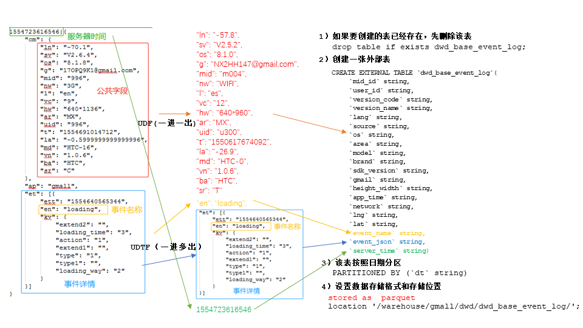
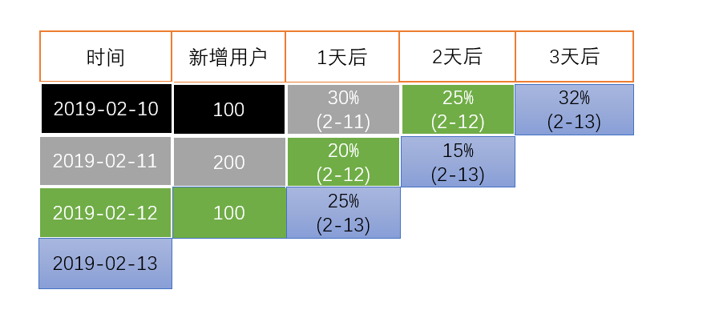

# 一、数仓分层

## 1.概念

### 1.1 分层原因

>**复杂问题简单化**
将一个复杂的**任务分解**成多个步骤，每层只处理单一的步骤，**比较简单，方便定位问题**

>**减少重复开发**
规范数据分层，通过的**中间层数据**，能够减少极大的重复计算，增加一次计算结果的复用性

>**隔离原始数据**
不论是数据的异常还是数据的敏感性，使真是数据与统计数据**解耦**开

### 1.2 数仓分层

>**ODS层(original data storage原始数据层)**
存放原始数据，直接加载原始日志、数据，数据保持原貌不作处理

>**DWD层(data warehouse detail明细数据层)**
结构和粒度与原始表保持一致，**ODS层数据进行清洗(去除空值、脏数据、超过极限范围的数据)**，个别公司称为DWI

>**DWS层(data warehouse service服务数据层)**
以DWD为基础，**进行数据轻度汇总**，一般聚集到以用户当日、设备当日、商家当日、商品当日等等的粒度
通常会有以某个维度为线索，组成跨主题的宽表，比如，一个用户的当日的签到数、收藏数、评论数、抽奖数、订阅数、点赞数、流浪商品数、添加购物车数、下单数、支持数、退款数、点击广告数组成的列表

>**ADS层(application data storage数据应用层)**
**为各种统计报表提供数据**，也有称为APP层、DM等

## 2.数据集市和数据仓库

**数据集市(Data Market)**是一种**微型的数据仓库**，通常有更少的数据，更少的主题区域，以及更少的历史数据，因此是**部门级**的，一般只能为某个局部范围内的管理人员服务
**数据仓库**是**企业级**的，能为整个企业各个部门的运行提供决策支持手段
 * 数据集市现在市面上的公司和书籍对数据集市有不同的概念

## 3.数仓命名规范

 * ODS层 --- ods
 * DWD层 --- dwd
 * DWS层 --- dws
 * ADS层 --- ads
 * 临时表数据库命名为 xxx_tmp
 * 备份数据数据库命名为 xxx_bak


# 二、数仓搭建环境准备

**集群规划**
|       | hadoop102 | hadoop103 | hadoop104 |
| :---- | :-------- | :-------- | :-------- |
| Hive  | Hive      |           |           |
| MySQL | MySQL     |           |           |

## 1.Hive & MySQL

[安装配置步骤](link/steps.md)

```bash
# 关闭元数据检查
vim /opt/module/hive/conf/hive-site.xml
```
```xml
<property>
    <name>hive.metastore.schema.verification</name>
    <value>false</value>
</property>
```

## 2.Hive引擎Tez
Tez是一个Hive的运行引擎，性能优于MR。为什么优于MR呢？看下图。

用Hive直接编写MR程序，假设有四个有依赖关系的MR作业，上图中，绿色是Reduce Task，云状表示写屏蔽，需要将中间结果持久化写到HDFS。
Tez可以将多个有依赖的作业转换为一个作业，这样只需写一次HDFS，且中间节点较少，从而大大提升作业的计算性能。

### 2.1 安装配置

[Tez安装配置上传测试](link/steps.md)

### 2.2 问题总结

>**运行Tez检查到用过多内存而被NodeManager杀死进程**
Caused by: org.apache.tez.dag.api.SessionNotRunning: TezSession has already shutdown. Application application_1546781144082_0005 failed 2 times due to AM Container for appattempt_1546781144082_0005_000002 exited with  exitCode: -103
For more detailed output, check application tracking page:http://hadoop103:8088/cluster/app/application_1546781144082_0005Then, click on links to logs of each attempt.
Diagnostics: Container [pid=11116,containerID=container_1546781144082_0005_02_000001] is running beyond virtual memory limits. Current usage: 216.3 MB of 1 GB physical memory used; 2.6 GB of 2.1 GB virtual memory used. Killing container.

>**问题原因:从机上运行的Container试图使用过多的内存，而被NodeManager kill掉了**
The NodeManager is killing your container. It sounds like you are trying to use hadoop streaming which is running as a child process of the map-reduce task. The NodeManager monitors the entire process tree of the task and if it eats up more memory than the maximum set in mapreduce.map.memory.mb or mapreduce.reduce.memory.mb respectively, we would expect the Nodemanager to kill the task, otherwise your task is stealing memory belonging to other containers, which you don't want.

>**解决方法，修改yarn-site.xml重启集群**
```xml
<property>
    <name>yarn.nodemanager.vmem-check-enabled</name>
    <value>false</value>
</property>
```

## 3.元数据备份

元数据备份（重点，如数据损坏，可能整个集群无法运行，至少要保证每日零点之后备份到其它服务器两个复本）
[MySQL HA配置](link/steps.md)

# 三、ODS层搭建
 * 原始数据层，存放原始数据，直接加载原始日志、数据，数据保持原貌不作处理

**ODS层启动日志表ods_start_log分析**

```json
//原始数据格式
{
    "action": "1",
    "ar": "MX",
    "ba": "Huawei",
    "detail": "325",
    "en": "start",
    "entry": "4",
    "extend1": "",
    "g": "B059F50H@gmail.com",
    "hw": "1080*1920",
    "l": "es",
    "la": "-0.7",
    "ln": "-42.9",
    "loading_time": "9",
    "md": "Huawei-0",
    "mid": "995",
    "nw": "3G",
    "open_ad_type": "1",
    "os": "8.0.9",
    "sr": "F",
    "sv": "V2.5.5",
    "t": "1554653309882",
    "uid": "995",
    "vc": "1",
    "vn": "1.3.1"
}
```
```sql
-- 如果创建的表已经存在，先删除表
drop table if exists ods_start_log;
-- 创建外部表，字段为string类型的json
CREATE EXTERNAL TABLE  ods_start_log (line string)
-- 表按照日期分区
PARTITIONED BY (`dt` string)
-- LZO压缩格式处理
STORED AS
  INPUTFORMAT 'com.hadoop.mapred.DeprecatedLzoTextInputFormat'
  OUTPUTFORMAT 'org.apache.hadoop.hive.ql.io.HiveIgnoreKeyTextOutputFormat'
-- 设置数据存储位置
LOCATION '/warehouse/gmall/ods/ods_start_log';
```

[HQL脚本](../Database/hql/ods.hql)

```bash
# 为lzo文件创建索引
hadoop jar /opt/module/hadoop-2.7.2/share/hadoop/common/hadoop-lzo-0.4.20.jar com.hadoop.compression.lzo.DistributedLzoIndexer /warehouse/gmall/ods/ods_start_log/dt=2019-08-24
hadoop jar /opt/module/hadoop-2.7.2/share/hadoop/common/hadoop-lzo-0.4.20.jar com.hadoop.compression.lzo.DistributedLzoIndexer /warehouse/gmall/ods/ods_event_log/dt=2019-08-24
```
[ODS层加载数据脚本](../ShellScript/ods_log.sh)

# 四、DWD层搭建
 * 对ODS层数据进行清洗（去除空值，脏数据，超过极限范围的数据，行式存储改为列存储，改压缩格式）。
## 1.启动表数据解析

每个设备的数据看作一条，
把数据按照mid_id进行分组，
再把相同字段的不同行数据先使用collect_set变为一个数组，
然后使用concat_ws把数组元素拼接成字符串。
[HQL脚本](../Database/hql/dwd_start.hql)

[ODS层加载数据脚本](../ShellScript/dwd_start_log.sh)

## 2.事件表数据解析
### 2.1 创建事件表

[HQL脚本](../Database/hql/dwd_base.hql)


### 2.2 自定义UDF函数
 * 解析共同字段
 * 自定义UDF函数见见Maven工程文件 hivefunction

### 2.3 自定义UDTF函数
 * 解体具体事件字段

[DWD层数据解析脚本](../ShellScript/dwd_base_log.sh)

 * 自定义UDTF函数见Maven工程文件 hivefunction


```bash
# 上传jar包到hdfs
hadoop fs -mkdir /user/hive/jars
hadoop fs -put hivefunction-1.0-SNAPSHOT-jar-with-dependencies.jar /user/hive/jars
hadoop fs -put hivefunction-1.0-SNAPSHOT.jar /user/hive/jars
```
```sql
-- 创建永久函数与jar包关联
create function base_analizer 
as 'com.tian.udf.BaseFieldUDF' 
using jar 'hdfs://hadoop102:9000/user/hive/jars/hivefunction-1.0-SNAPSHOT.jar';

create function flat_analizer 
as 'com.tian.udtf.EventJsonUDTF' 
using jar 'hdfs://hadoop102:9000/user/hive/jars/hivefunction-1.0-SNAPSHOT.jar'; 
```
## 3.事件表获取

[HQL脚本](../Database/hql/dwd_event.hql)

[DWD层数据解析脚本](../ShellScript/dwd_event_log.sh)

# 五、业务知识准备
## 1.业务术语

>**用户**
用户以设备为判断标准，在移动统计中，每个独立设备认为是一个独立用户。Android系统根据IMEI号，IOS系统根据OpenUDID来标识一个独立用户，每部手机一个用户。

>**新增用户**
首次联网使用应用的用户。如果一个用户首次打开某APP，那这个用户定义为新增用户；卸载再安装的设备，不会被算作一次新增。新增用户包括日新增用户、周新增用户、月新增用户。

>**活跃用户**
打开应用的用户即为活跃用户，不考虑用户的使用情况。每天一台设备打开多次会被计为一个活跃用户。

>**周(月)活跃用户**
某个自然周（月）内启动过应用的用户，该周（月）内的多次启动只记一个活跃用户。

>**月活跃率**
月活跃用户与截止到该月累计的用户总和之间的比例。

>**沉默用户**
用户仅在安装当天（次日）启动一次，后续时间无再启动行为。该指标可以反映新增用户质量和用户与APP的匹配程度。

>**版本分布**
不同版本的周内各天新增用户数，活跃用户数和启动次数。利于判断APP各个版本之间的优劣和用户行为习惯。

>**本周回流用户**
上周未启动过应用，本周启动了应用的用户。

>**连续n周活跃用户**
连续n周，每周至少启动一次。

>**忠诚用户**
连续活跃5周以上的用户

>**连续活跃用户**
连续2周及以上活跃的用户

>**近期流失用户**
连续n(2<= n <= 4)周没有启动应用的用户。（第n+1周没有启动过）

>**留存用户**
某段时间内的新增用户，经过一段时间后，仍然使用应用的被认作是留存用户；这部分用户占当时新增用户的比例即是留存率。
例如，5月份新增用户200，这200人在6月份启动过应用的有100人，7月份启动过应用的有80人，8月份启动过应用的有50人；则5月份新增用户一个月后的留存率是50%，二个月后的留存率是40%，三个月后的留存率是25%。


>**用户新鲜度**
每天启动应用的新老用户比例，即新增用户数占活跃用户数的比例。

>**单次使用时长**
每次启动使用的时间长度。

>**日使用时长**
累计一天内的使用时间长度。

>**启动次数计算标准**
IOS平台应用退到后台就算一次独立的启动；Android平台我们规定，两次启动之间的间隔小于30秒，被计算一次启动。用户在使用过程中，若因收发短信或接电话等退出应用30秒又再次返回应用中，那这两次行为应该是延续而非独立的，所以可以被算作一次使用行为，即一次启动。业内大多使用30秒这个标准，但用户还是可以自定义此时间间隔。

## 2.系统函数

### 2.1 collect_set函数
```sql
-- 1）创建原数据表 

drop table if exists stud;
create table stud (name string, area string, course string, score int);
-- 2）向原数据表中插入数据 

insert into table stud values('zhang3','bj','math',88);
insert into table stud values('li4','bj','math',99);
insert into table stud values('wang5','sh','chinese',92);
insert into table stud values('zhao6','sh','chinese',54);
insert into table stud values('tian7','bj','chinese',91);
-- 3）查询表中数据 
 select * from stud;
stud.name       stud.area       stud.course     stud.score
zhang3          bj              math            88
li4             bj              math            99
wang5           sh              chinese         92
zhao6           sh              chinese         54
tian7           bj              chinese         91
-- 4）把同一分组的不同行的数据聚合成一个集合  
select course, collect_set(area), avg(score) 
from stud 
group by course;
-- chinese ["sh","bj"]     79.0
-- math    ["bj"]  93.5
-- 5） 用下标可以取某一个 
select course, collect_set(area)[0], avg(score) 
from stud 
group by course;
-- chinese sh      79.0
-- math    bj      93.5
```
### 2.2 日期处理函数
```sql
-- 1）date_format函数（根据格式整理日期） 
 select date_format('2019-08-24','yyyy-MM');
2019-02
-- 2）date_add函数（加减日期） 
 select date_add('2019-08-24',-1);
2019-02-09
 select date_add('2019-08-24',1);
2019-02-11
-- 3）next_day函数 
-- （1）取当前天的下一个周一
 select next_day('2019-02-12','MO');
2019-02-18
-- 说明：星期一到星期日的英文（Monday，Tuesday、Wednesday、Thursday、Friday、Saturday、Sunday） 
-- （2）取当前周的周一 
 select date_add(next_day('2019-02-12','MO'),-7);
2019-02-11
-- 4）last_day函数（求当月最后一天日期） 
 select last_day('2019-08-24');
2019-02-28
```

# 六、用户需求

## 1.用户活跃主题

### 1.1 DWS 活跃设备明细
 * 只是统计活跃设备只需要mid_id，其他字段是为了以后有可能的业务需要。

[hql语句](../Database/hql/dws_uv.hql)
[DWS层数据加载脚本](../ShellScript/dws_uv_log.sh)

### 1.2 ADS 活跃设备数
[hql语句](../Database/hql/ads_uv.hql)
[ADS层数据加载脚本](../ShellScript/ads_uv_log.sh)

## 2.用户新增主题

### 2.1 DWS 每日新增设备明细表
[hql语句](../Database/hql/dws_new_mid.hql)

### 2.2 ADS 每日新增设备表
[hql语句](../Database/hql/ads_new_mid.hql)
## 3.用户留存主题
### 3.1 需求分析

**留存用户**某段时间内新增用户(活跃用户)，经过一段时间后，又继续使用应用的被认作是留存用户。
**留存率**留存用户占当时新增用户(活跃用户)的比例即是留存率。



### 3.2 DWS

#### 3.2.1 每日留存用户明细表
[hql语句](../Database/hql/dws_user_retention_day.hql)
#### 3.2.2 1,2,3,n天留存用户明细表
[hql语句](../Database/hql/dws_user_retention_day.hql)
#### 3.2.3 Union 和 Union all
1）准备两张表
```
tableA			                  tableB
id　　name　　score             id　　name　　score
1　　　a　　　　80               1　　  d　　　　48
2　　  b　　　　79               2　　　e　　　　23
3　　  c　　  　68               3　　　c　　　　86
```
2）采用union查询
```sql
select name from tableA　　　　　　　　　　　　　
union　　　　　　　　　　　　　　　　　　　　　　　　
select name from tableB　　　　　　　　　　　　　
# 查询结果
# name
# a
# d
# b
# e
# c
```
3）采用union all查询
```sql
select name from tableA
union all
select name from tableB
# 查询结果
# name
# a
# b
# c
# d
# e
# c
```
4）总结
 * union会将联合的结果集去重，效率较union all差
 * union all不会对结果集去重，所以效率高

### 3.3 ADS
#### 3.3.1 留存用户数
[hql语句](../Database/hql/ads_user_retention_day_count.hql)

#### 3.3.2 留存用户比例
[hql语句](../Database/hql/ads_user_retention_day_rate.hql)

## *新数据准备

 * 按照后续需求分别采集消费其他天数的数据并分别加载到数据库

## 4.沉默用户数

### 4.1 DWS

 * 使用日活明细表dws_uv_detail_day作为DWS层数据

### 4.2 ADS

[hql语句](../Database/hql/ads_silent_count.hql)
[数据加载脚本](../ShellScript/ads_silent_log.sh)

## 5.本周回流用户数

### 5.1 DWS
 * 本周回流=本周活跃-本周新增-上周活跃
 * 使用日活明细表dws_uv_detail_day作为DWS层数据

### 5.2 ADS
[hql语句](../Database/hql/ads_back_count.hql)
[数据加载脚本](../ShellScript/ads_back_log.sh)

## 6.流失用户数
### 6.1 DWS
 * 使用日活明细表dws_uv_detail_day作为DWS层数据

### 6.2 ADS
[hql语句](../Database/hql/ads_wastage_count.hql)
[数据加载脚本](../ShellScript/ads_wastage_log.sh)

## 7.最近连续三周活跃用户数
 * 最近3周连续活跃的用户：通常是周一对前3周的数据做统计，该数据一周计算一次。

### 7.1 DWS
 * 使用周活明细表dws_uv_detail_wk作为DWS层数据

### 7.2 ADS
[hql语句](../Database/hql/ads_continuity_wk_count.hql)
[数据加载脚本](../ShellScript/ads_continuity_wk_log.sh)

## 8.最近七天连续三天活跃用户数
 * 最近7天内连续3天活跃用户数

### 8.1 DWS
 * 使用日活明细表dws_uv_detail_day作为DWS层数据

### 8.2 ADS
[hql语句](../Database/hql/ads_continuity_uv_count.hql)
[数据加载脚本](../ShellScript/ads_continuity_log.sh)

# 七、总结

## 1.用户行为数仓业务总结

### 1.1 数仓分层介绍
>**ODS层(原始数据层)**
存储原始数据，直接加载原始日志、数据，数据保持原貌不做处理

>**DWD层(明细层)**
对ODS层数据进行清洗(去除空值、脏数据，唱过集显范围的数据)

>**DWS层(服务数据层)**
以DWD层为基础，进行轻度汇总，如用户当日、设备当日、商品当日

>**ADS层(数据应用层)**

### 1.2 Tez引擎的优点
 * Tez可以将多个有依赖的作业转换为一个作业，这样只需写一次HDFS，且中间节点较少，从而大大提升作业的计算性能。

### 1.3 项目中的UDF和UDTF函数，以及所解决的问题
 * 用UDF函数解析公共字段，用UDTF函数解析时间字段

### 1.4 如何分析用户活跃
 * 在启动日志中统计不同设备id出现次数

### 1.5 如何分析用户新增
 * 用活跃用户表left join用户新增表，用户新增表中mid为空的即为用户新增

### 1.6 如何分析用户1天留存
 * 留存用户=前一天新增join今天活跃
 * 用户留存率=留存用户/前一天新增

### 1.7 如何分析沉默用户
 * 按照设备id对日活表分组，登录次数为1，且是在一周前登录

### 1.8 如何分析本周回流用户
 * 本周活跃left join本周新增left join上周活跃，且本周新增id和上周活跃id都为null

### 1.9 如何分析流失用户
 * 按照设备id对日活表分组，且七天内没有登录过

### 1.10 如何分析最近连续三周活跃用户数
 * 按照设备id对周活进行分组，统计次数等于3次。

### 1.11 如何分析最近七天内连续三天活跃用户数
 * 查询出最近7天的活跃用户，并对用户活跃日期进行排名
 * 计算用户活跃日期及排名之间的差值
 * 对同用户及差值分组，统计差值个数
 * 将差值相同个数大于等于3的数据取出，然后去重，即为连续3天及以上活跃的用户

### 1.12 整个文档中设计的所有层级及表的总结
<!-- TODO 复盘用户行为数仓 -->

## 2.Hive总结

### 2.1 Hive的架构


### 2.2 Hive和数据库比较
 * Hive和数据库处理拥有类似的查询语言，再无相似之处
>**数据存储位置**
Hive存储HDFS，数据库将数据保存在块设备或者本地文件系统

>**数据更新**
Hive中不建议对数据的改写，而数据库中的数据通常是需要经常进行修改

>**执行延迟**
Hive执行延迟较高，数据库的执行延迟较低，当然这个是有条件的，即数据规模较小，
当数据规模大到超过数据库的处理能力的时候，Hive的并行计算显然能体现出优势。

>**数据规模**
Hive支持很大规模的数据计算，数据库可以支持的数据规模较小

### 2.3 内部表和外部表

>**管理表**
当我们删除一个管理表时，Hive也会删除这个表中的数据，管理表不适合和其他工具共享数据

>**外部表**
删除该表并不会删除掉掉原始数据，删除的只是表的元数据，数据仍旧存放在HDFS，只需要重新执行建表语句就能找回外部表。

### 2.4 四个By的区别
>**Sort By** 分区内有序

>**Order By** 全局排序，只有一个Reducer

>**Distribute By** 类似MR中Partition，进行分区，结合sort by使用。

>**Cluster By** 当Distribute by和Sort by字段相同时，可以使用Cluster by，但是该方式只有升序排序。

### 2.5 窗口函数

>**OVER()** 指定分析函数工作的数据窗口大小，这个数据窗口大小可能会随着行的变化而变化，常用partition by分区和order by排序

>**CURRENT ROW** 当前行

>**n PRECEDING** 往前n行数据

>**n FOLLOWING** 往后n行数据

>**UNBOUNDED** 起点，UNBOUNDED PRECEDING表示从前面的起点，UNBOUNDED FOLLOWING表示到后面的终点

>**LAG(col,n)** 往前n行数据

>**DENSE_RANK()** 排序相同会重复，总数会减少

>**ROW_NUMBER()** 会根据顺序计算

### 2.6 项目中自定过的UDF和UDTF函数，以及用他们处理什么问题
 * 出于业务需要，曾使用自定义UDF函数计算某日期是该年的第几天(Hive中没有自带该函数)
 * 使用UDF函数解析共同字段，使用UDTF函数解析事件字段
 * 自定义UDF步骤，定义一个类阶乘UDF，重写evaluate方法
 * 自定义UDTF步骤，定义一个类继承GenericUDTF，重写init()，close()和process()方法

### 2.7 Hive优化

>**MapJoin**
如果不指定MapJoin或者不复合MapJoin的条件，那么Hive解析器会将Join操作转换成Common Join，即在Reduce阶段完成join，容易发生数据倾斜。可以使用MapJoin把小表全部加载到内存Map端进行join，避免reducer处理

>**行列过滤**
列处理，在select中只拿需要的列，尽量使用分区过滤，避免使用select *
行处理，在分区剪裁中，当使用外关联时，如果将附表的过滤条件卸载where后面，那么就会先全表关联，之后再过滤。

>**采用分桶技术**

>**采用分区技术**

>**合理设置Map个数**
通常情况下，作业会通过input的目录产生一个或多个map任务，主要决定因素有，input的文件总个数，input的文件大小，集群中设置的文件块大小。
Map数不是越多越好，如果一个任务有多个小文件，对于小文件而言map的启动和初始化时间远大于逻辑处理时间，就会造成很大的资源浪费，而且系统并发执行map的个数是受限的。
每个map处理的文件块都接近与128M并不一定就是最好，因为当某个文件虽然接近128M但是处理该文件块时的map逻辑很复杂，只交给一个map处理就会很耗时。
针对后两种情况，我们分别通过减少map数和增加map数的方式解决。

>**小文件合并**
在Map执行前合并小文件，减少map数，CombineHiveInputFormat具有对小文件的合并功能(系统默认的格式)，HiveInputFormat没有对小文件的合并功能。

>**合理设置Reduce数**
Reduce数并不是越多越好
过多的启动和初始化Reduce也会消耗时间和资源
输出文件的个数和Reduce个数一致，当这次reduce的输出作为下次Map的输入时，可能会有小文件过多的问题。
在设置Reduce个数的时候也需要考虑两个原则:处理大数据量利用合适的Reduce数;使单个Reduce任务处理数据量大小要合适。

>**常用参数**
```sql
// 输出合并小文件
SET hive.merge.mapfiles = true; -- 默认true，在map-only任务结束时合并小文件
SET hive.merge.mapredfiles = true; -- 默认false，在map-reduce任务结束时合并小文件
SET hive.merge.size.per.task = 268435456; -- 默认256M
SET hive.merge.smallfiles.avgsize = 16777216; -- 当输出文件的平均大小小于该值时，启动一个独立的map-reduce任务进行文件merge
```