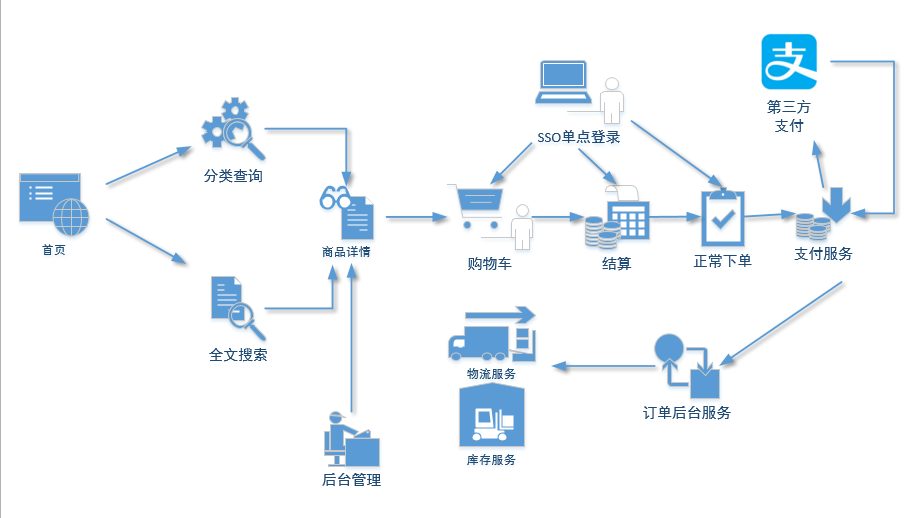
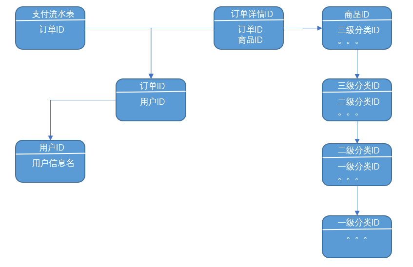
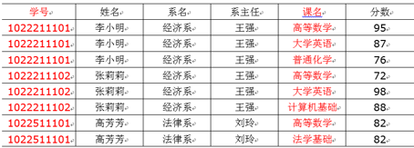
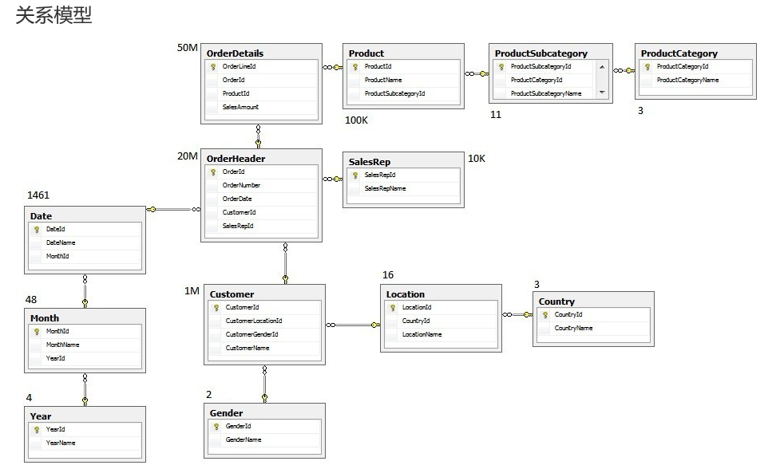
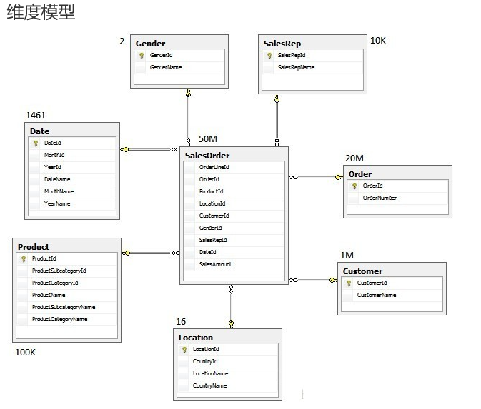
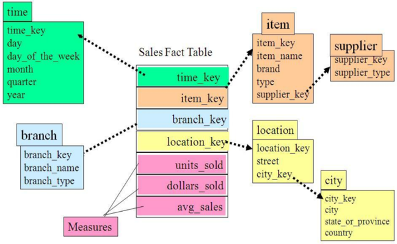
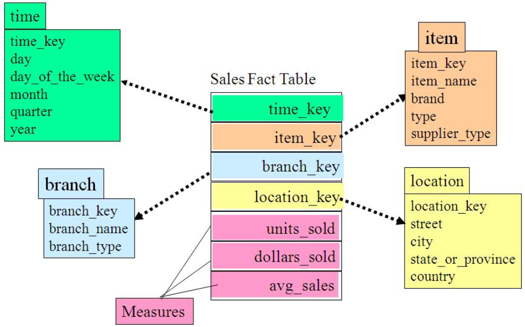
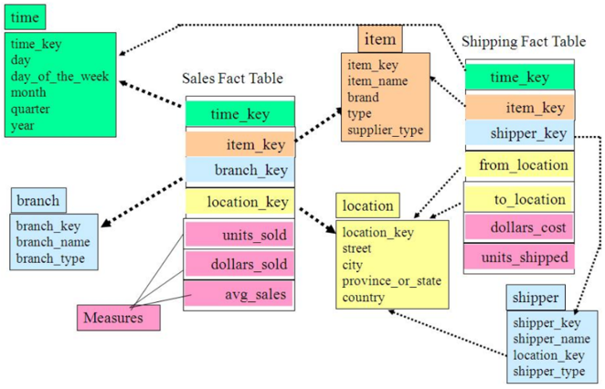

# 一、电商业务与数据结构简介
## 1.电商业务流程


## 2.电商常识(SKU、SPU)
**SKU(Stock Keeping Unit)**，库存量基本单位，现在已经被引申为产品统一编号的简称，每种产品均对应有唯一的SKU号。
**SPU(Standard Product Unit)**，是商品信息聚合的最小单位，是一组可复用、易检索的标准化信息集合。

购买一台iPhoneX手机，iPhoneX手机就是一个SPU，但是你购买的时候，不可能是以iPhoneX手机为单位买的，商家也不可能以iPhoneX为单位记录库存SKU。必须要以什么颜色什么版本的iPhoneX为单位。比如，你购买的是一台银色、128G内存的、支持联通网络的iPhoneX，商家也会以这个单位来记录库存数。那这个更细致的单位就叫库存单元(SKU)，SPU表示一类商品。好处就是：可以共用商品图片，海报、销售属性等。

## 3.电商表结构

### 3.1 订单表(order_info))

| 标签         | 含义       |
| ------------ | ---------- |
| id           | 订单编号   |
| total_amount | 订单金额   |
| order_status | 订单状态   |
| user_id      | 用户id     |
| payment_way  | 支付方式   |
| out_trade_no | 支付流水号 |
| create_time  | 创建时间   |
| operate_time | 操作时间   |

### 3.2 订单详情表(order_detail)

| 标签        | 含义     |
| ----------- | -------- |
| id          | 订单编号 |
| order_id    | 订单号   |
| user_id     | 用户id   |
| sku_id      | 商品id   |
| sku_name    | 商品名称 |
| order_price | 商品价格 |
| sku_num     | 商品数量 |
| create_time | 创建时间 |

### 3.3 商品表

| 标签         | 含义     |
| ------------ | -------- |
| id           | skuId    |
| spu_id       | spuid    |
| price        | 价格     |
| sku_name     | 商品名称 |
| sku_desc     | 商品描述 |
| weight       | 重量     |
| tm_id        | 品牌id   |
| category3_id | 品类id   |
| create_time  | 创建时间 |

### 3.4 用户表

| 标签        | 含义     |
| ----------- | -------- |
| id          | 用户id   |
| name        | 姓名     |
| birthday    | 生日     |
| gender      | 性别     |
| email       | 邮箱     |
| user_level  | 用户等级 |
| create_time | 创建时间 |

### 3.5 商品一级分类表

| 标签 | 含义 |
| ---- | ---- |
| id   | id   |
| name | 名称 |

### 3.6 商品二级分类表

| 标签         | 含义       |
| ------------ | ---------- |
| id           | id         |
| name         | 名称       |
| category1_id | 一级品类id |

### 3.7 商品三级分类表

| 标签         | 含义       |
| ------------ | ---------- |
| id           | id         |
| name         | 名称       |
| Category2_id | 二级品类id |

### 3.8 支付流水表

| 标签            | 含义               |
| --------------- | ------------------ |
| id              | 编号               |
| out_trade_no    | 对外业务编号       |
| order_id        | 订单编号           |
| user_id         | 用户编号           |
| alipay_trade_no | 支付宝交易流水编号 |
| total_amount    | 支付金额           |
| subject         | 交易内容           |
| payment_type    | 支付类型           |
| payment_time    | 支付时间           |

# 二、数仓理论(面试重点)
## 1.表的分类
### 1.1 实体表

**实体表**一般是指一个**现实存在的业务对象**，比如用户、商品、商家、销售员等等

如，用户表

| 用户id | 姓名 | 生日       | 性别 | 邮箱       | 用户等级 | 创建时间   |
| ------ | ---- | ---------- | ---- | ---------- | -------- | ---------- |
| 1      | 张三 | 2011-11-11 | 男   | zs@163.com | 2        | 2018-11-11 |
| 2      | 李四 | 2011-11-11 | 女   | ls@163.com | 3        | 2018-11-11 |
| 3      | 王五 | 2011-11-11 | 中性 | ww@163.com | 1        | 2018-11-11 |
| …      | …    | …          | …    | …          | …        | …          |

### 1.2 维度表

维度表，一般是指对应一些业务状态，编号的解释表，也可以称之为码表

比如地区表、订单状态、支付方式、审批和状态、商品分类等等

| 订单状态编号 | 订单状态名称 |
| ------------ | ------------ |
| 1            | 未支付       |
| 2            | 支付         |
| 3            | 发货中       |
| 4            | 已发货       |
| 5            | 已完成       |

| 商品分类编号 | 分类名称 |
| ------------ | -------- |
| 1            | 服装     |
| 2            | 保健     |
| 3            | 电器     |
| 4            | 图书     |

### 1.3 事务型事实表

**事务型事实表**，一般指随着业务发生不断产生的数据。特点是**一旦发生不会再变化**。
一般比如，**交易流水**，**操作日志**，**出库入库记录**等等。

| 编号   | 对外业务编号 | 订单编号 | 用户编号 | 支付宝交易流水编号 | 支付金额 | 交易内容    | 支付类型  | 支付时间            |
| ------ | ------------ | -------- | -------- | ------------------ | -------- | ----------- | --------- | ------------------- |
| 1      | 7577697945   | 1        | 111      | QEyF-63000323      | 223.00   | 海狗人参丸1 | alipay    | 2019-02-10 00:50:02 |
| 2      | 0170099522   | 2        | 222      | qdwV-25111279      | 589.00   | 海狗人参丸2 | wechatpay | 2019-02-10 00:50:02 |
| 3      | 1840931679   | 3        | 666      | hSUS-65716585      | 485.00   | 海狗人参丸3 | unionpay  | 2019-02-10 00:50:02 |
| 。。。 | 。。。       | 。。。   | 。。。   | 。。。             | 。。。   | 。。。      | 。。。    | 。。。              |

### 1.4 周期型事实表

周期型事实表，一般指随着业务不断产生变化的数据，与事务型不同的时，数据会随着业务周期性的推进变化，比如订单，其中订单状态会周期性变化，再比如，请假、贷款申请，随着批复状态在周期性变化。

| 订单编号 | 订单金额 | 订单状态 | 用户id | 支付方式  | 支付流水号    | 创建时间            | 操作时间            |
| -------- | -------- | -------- | ------ | --------- | ------------- | ------------------- | ------------------- |
| 1        | 223.00   | 2        | 111    | alipay    | QEyF-63000323 | 2019-02-10 00:01:29 | 2019-02-10 00:01:29 |
| 2        | 589.00   | 2        | 222    | wechatpay | qdwV-25111279 | 2019-02-10 00:05:02 | 2019-02-10 00:05:02 |
| 3        | 485.00   | 1        | 666    | unionpay  | hSUS-65716585 | 2019-02-10 00:50:02 | 2019-02-10 00:50:02 |
| 。。。   | 。。。   | 。。。   | 。。。 | 。。。    | 。。。        | 。。。              | 。。。              |


## 2.同步策略
数据同步策略的类型包括：全量表、增量表、新增及变化表、拉链表

> **全量表**：存储完整的数据。

> **增量表**：存储新增加的数据。

> **新增及变化表**：存储新增加的数据和变化的数据。

> **拉链表**：对新增及变化表做定期合并。

### 2.1 实体表同步策略

实体表：比如用户，商品，商家，销售员等
实体表数据量比较小：通常可以做每日全量，就是每天存一份完整数据。**即每日全量**。

### 2.2 维度表同步策略

维度表：比如订单状态，审批状态，商品分类
维度表数据量比较小：通常可以做每日全量，就是每天存一份完整数据。即每日全量。

> **说明**
> 针对可能会有变化的状态数据可以存储**每日全量**。
> 没变化的客观世界的维度（比如性别，地区，民族，政治成分，鞋子尺码）可以只**存一份固定值**。

### 2.3 事务型事实表同步策略

事务型事实表：比如，交易流水，操作日志，出库入库记录等。
因为数据不会变化，而且数据量巨大，所以每天只同步新增数据即可，所以可以做成每日增量表，即每日创建一个分区存储。

### 2.4 周期型事实表同步策略

周期型事实表：比如，订单、请假、贷款申请等
这类表从数据量的角度，存每日全量的话，数据量太大，冗余也太大。如果用每日增量的话无法反应数据变化。
 每日新增及变化量，包括了当日的新增和修改。一般来说这个表，足够计算大部分当日数据的。但是这种依然无法解决能够得到某一个历史时间点（时间切片）的切片数据。 
 所以要用利用每日新增和变化表，制作一张拉链表，以方便的取到某个时间切片的快照数据。所以我们需要得到每日新增及变化量。

**拉链表**

| name姓名 | start新名字创建时间 | end名字更改时间 |
| -------- | ------------------- | --------------- |
| 张三     | 1990/1/1            | 2018/12/31      |
| 张小三   | 2019/1/1            | 2019/4/30       |
| 张大三   | 2019/5/1            | 9999-99-99      |
| 。。。   | 。。。              | 。。。          |

```sql
select * from user where start =<'2019-1-2' and end>='2019-1-2';
```

## 3.范式理论

### 3.1 范式概念

关系型数据库设计时，遵照一定的规范要求，目的在于降低数据的冗余性，目前业界范式有：第一范式(1NF)、第二范式(2NF)、第三范式(3NF)、巴斯-科德范式(BCNF)、第四范式(4NF)、第五范式(5NF)。
范式可以理解为设计一张数据表的表结构，符合的标准级别。

 >使用范式的**根本目的**是：
  1）减少数据冗余，尽量让每个数据只出现一次。
  2）保证数据一致性

 **缺点**是获取数据时，需要通过Join拼接出最后的数据。


### 3.2 函数依赖

>**完全函数依赖**
设X，Y是关系R的两个属性集合，X'是X的真子集，存在X→Y，但对每一个X'都有X'!→Y，则称Y完全函数依赖于X。通过AB能得出C，但是A和B单独得不出C，那么说C完全依赖于AB。

>**部分函数依赖**
假如 Y函数依赖于 X，但同时 Y 并不完全函数依赖于 X，那么我们就称 Y 部分函数依赖于 X，通过AB能得出C，通过A也能得出C，或者通过B也能得出C，那么说C部分依赖于AB。

>**传递函数依赖**
传递函数依赖：设X，Y，Z是关系R中互不相同的属性集合，存在X→Y(Y !→X),Y→Z，则称Z传递函数依赖于X。通过A得到B，通过B得到C，但是C得不到A，那么说C传递依赖于A。

### 3.3 三范式区分
>**第一范式1NF**核心原则就是:**属性不可切割**

|  ID   |    商品     |  商家ID   | 用户ID |
| :---: | :---------: | :-------: |
|  001  | **5台电脑** | XXX旗舰店 | 00001  |

上表的5台电脑不遵守第一范式，修改后如下

|  ID   |   商品   | 数量  |  商家ID   | 用户ID |
| :---: | :------: | :---: | :-------: |
|  001  | **电脑** |   5   | XXX旗舰店 | 00001  |

实际上，1NF是所有**关系型数据库的最基本要求**，你在关系型数据库管理系统（RDBMS），例如SQL Server，Oracle，MySQL中创建数据表的时候，**如果数据表的设计不符合这个最基本的要求，那么操作一定是不能成功的**。也就是说，只要在RDBMS中已经存在的数据表，一定是符合1NF的。

>**第二范式2NF**核心原则就是:**不能存在部分函数依赖**


上表明显存在部分依赖，比如表的主键是(学号、课名)，分数确实完全依赖于(学号，课名)，但是姓名并不完全依赖于学号，改写成符合2NF的表如下

|    学号     |   课名   | 分数  |
| :---------: | :------: | :---: |
| 10222311101 | 高等数学 |  95   |
|     ...     |   ...    |  ...  |

|    学号    |  姓名  |  系名  | 系主任 |
| :--------: | :----: | :----: | :----: |
| 1022211101 | 李小明 | 经济系 | 王强   |
|    ...     |  ...   |  ...   | ...    |

>**第三范式3NF**核心原则就是:**不能存在传递函数依赖**

|    学号    |  姓名  |  系名  | 系主任 |
| :--------: | :----: | :----: | :----: |
| 1022211101 | 李小明 | 经济系 | 王强   |
|    ...     |  ...   |  ...   | ...    |

上表存在传递函数依赖:学号->系名->系主任
再次拆解为如下

|    学号    |  姓名  |  系名  |
| :--------: | :----: | :----: |
| 1022211101 | 李小明 | 经济系 |
|    ...     |  ...   |  ...   |

|  系名  | 系主任 |
| :----: | :----: |
| 经济系 |  王强  |
| 法律系 |  刘玲  |


## 4.关系建模和维度建模
>**关系模型**
关系模型主要应用与OLTP系统中，为了保证数据的一致性以及避免冗余，所以大部分业务系统的表都是遵循第三范式的。



>**维度模型**
维度模型主要应用于OLAP系统中，因为关系模型虽然冗余少，但是在大规模数据，跨表分析统计查询过程中，会造成多表关联，这会大大降低执行效率。
所以把相关各种表整理成两种：事实表和维度表两种。所有维度表围绕着事实表进行解释。



## 5.雪花模型、星型模型和星座模型
 * 在维度建模的基础上又分为三种模型：星型模型、雪花模型、星座模型。

>**雪花模型**，比较靠近3NF，但是无法完全遵守，因为遵循3NF的性能成本太高。多个维度间接关联到事实表，需要多次join。



>**星型模型**和雪花模型的区别主要在于维度的层级，标准的星型模型维度只有一层，而雪花模型可能会涉及多级。星型模型的维度表直接关联到事实表。只需要join一次。



>**星座模型**与前两种情况的区别是事实表的数量，星座模型是基于多个事实表。维度表直接关联到事实表。
基本上是很多数据仓库的常态，因为很多数据仓库都是多个事实表的。所以星座不星座只反映是否有多个事实表，他们之间是否共享一些维度表。
所以星座模型并不和前两个模型冲突。



>**模型的选择**
首先就是星座不星座这个只跟数据和需求有关系，跟设计没关系，不用选择。
星型还是雪花，取决于**性能优先**，还是**灵活更优先**。
目前实际企业开发中，不会绝对选择一种，根据情况灵活组合，甚至并存（一层维度和多层维度都保存）。但是整体来看，**更倾向于维度更少的星型模**型。尤其是Hadoop体系，减少Join就是减少Shuffle，性能差距很大。（关系型数据可以依靠强大的主键索引）


# 三、数仓搭建

## 0.配置Hadoop支持Snappy压缩

将编译后支持Snappy压缩的Hadoop jar包解压缩，并将`lib/native`目录下的所有文件上传到hadoop102的`/opt/module/hadoop-2.7.2/lib/native/`目录下，并分发到其他节点。
重启hadoop
```bash
# 检查支持的压缩方式
hadoop checknative
# hadoop:  true /opt/module/hadoop-2.7.2/lib/native/libhadoop.so
# zlib:    true /lib64/libz.so.1
# snappy:  true /opt/module/hadoop-2.7.2/lib/native/libsnappy.so.1
# lz4:     true revision:99
# bzip2:   false
```


## 1.业务数据生成


## 2.业务数据导入数仓

## 3.ODS层

## 4.DWD层

## 5.DWS层之用户行为宽表

# 四、业务需求