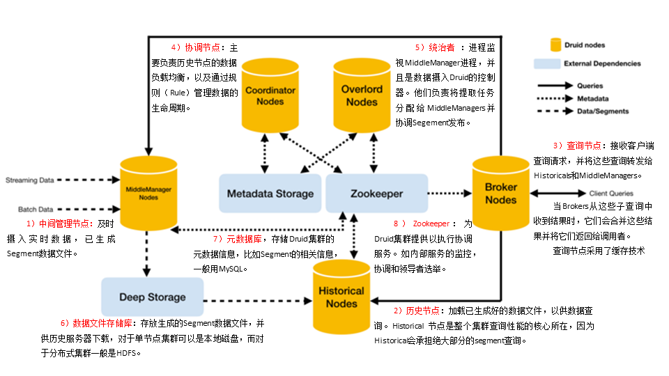

# 一、Presto
## 1.概述
### 1.1 概念
Presto是一个开源的分布式SQL查询引擎，数据量支持GB到PB字节，主要用来处理秒级查询的场景。
 * 虽然Presto可以解析SQL，但它不是一个标准的数据库，不是MySQL、Oracle的替代品，也不能用来处理在线事务(OLAP)


### 1.2 架构
<!-- TODO Presto架构图 -->

### 1.3 优缺点
mr的设计决定了数据素具需要多次落盘，会有大量磁盘IO，所以速度很慢，使用Presto能达到秒级查询。

>**优点**
Presto基于内存运算，减少了磁盘IO，计算更快。
能够连接多个数据源，跨数据源连表查，如从Hive查询大量网站访问记录，然后从MySQL中匹配设备信息

>**缺点**
Presto能够处理PB级别的海量数据分析，但Presto并不是把PB级数据放在内存中计算，而是根据场景，如Count、AVG等聚合运算，是边读取数据边计算、再清内存，再读数据再计算，这种设计并不耗内存，但是连表查就可能产生大量临时数据，因此速度会变慢，反而Hive此时会更擅长。

### 1.4 和Impala性能比较
[分析](https://blog.csdn.net/u012551524/article/details/79124532)
测试结论：Impala性能稍领先于Presto，但是Presto在数据源支持上非常丰富，包括Hive、图数据库、传统关系型数据库、Redis等。Impala只能分析Hive。

## 2.安装配置
[Presto安装配置](link/Steps.md)

## 3.Presto优化数据存储
### 3.1 合理设置分区
与Hive类似，Presto会根据元数据信息读取分区数据，合理的分区减少Presto数据读取量，提升查询性能。

### 3.2 使用列式存储
Presto对ORC文件读取做了特定优化，因此在Hive中创建Presto使用的表时，建议采用ORC格式存储，相对于Parquet，Presto对ORC支持更好

### 3.3 使用压缩
数据压缩可以减少节点间数据传输对IO带宽压力，对于即席查询需要快速解压，建议采用Snappy压缩

## 4.Presto优化查询SQL
### 4.1 只选择使用的字段
由于采用列式存储，选择需要的字段可加快字段的读取、减少数据量，避免使用`select *`读取字段。
```sql
[GOOD]: SELECT time, user, host FROM tbl
[BAD]:  SELECT * FROM tbl
```
### 4.2 过滤条件必须加上分区字段
对于有分区的表，where语句中优先使用分区字段进行过滤。
```sql
-- acct_day是分区字段，visit_time是具体访问时间

[GOOD]: SELECT time, user, host FROM tbl where acct_day=20171101
[BAD]:  SELECT * FROM tbl where visit_time=20171101
```

### 4.3 Group by语句优化
合理安排Group by语句中字段顺序对性能有一定提升。将Group by语句中字段按照每个字段distinct数据多少进行降序排列
```sql
[GOOD]: SELECT GROUP BY uid, gender
[BAD]:  SELECT GROUP BY gender, uid
```

### 4.4 Order by时使用Limit
Order by需要扫描数据到单个worker节点进行排序，导致单个worker需要大量内存。如果是查询TopN或者BottomN，使用limit可以减少排序计算和内存压力。
```sql
[GOOD]: SELECT * FROM tbl ORDER BY time LIMIT 100
[BAD]:  SELECT * FROM tbl ORDER BY time
```

### 4.5 使用join语句时将大表放在左边
Presto中join的默认算法是broadcast join，即将join左边的表分割到多个worker，然后将join右边的表数据整个复制一份发送到每个worker进行计算，如果右边的表数据量太大，则可能会报内存溢出错误
```sql
[GOOD] SELECT ... FROM large_table l join small_table s on l.id = s.id
[BAD] SELECT ... FROM small_table s join large_table l on l.id = s.id
```

## 5.注意事项
### 5.1 字段名引用
避免和关键字冲突:MySQL对字段加反引号、presto对字段加双引号分割，如果字段不是关键字则可以忽略

### 5.2 时间函数
对于Timestamp，需要进行比较的时候，需要加Timestamp关键字，而MySQL中对Timestamp可以直接进行比较。
```sql
-- MySQL中的写法
select t
from a 
where t > '2019-08-30 00:00:00';
-- presto写法
select t
from a 
where t > timestamp '2019-08-30 00:00:00';
```

### 5.3 不支持insert overwrite语法
presto不支持insert overwrite语法，只能先delete再insert into。

### 5.4 Parquet格式
presto支持Parquet，只支持查询，不支持insert

# 二、Druid
## 1.概述
### 1.1 概念
Druid是一个快速的列式分布式的支持实时分析的数据存储系统。它在处理PB级数据、毫秒级查询、数据实时处理方面，比传统的OLAP系统有了显著的性能改进。

[Druid官网](http://druid.io)

 * 阿里巴巴也曾经创建过一个开源项目叫做Druid(简称阿里Druid)，它是一个数据库连接池的项目。阿里Druid和本文中所讨论的Druid没有任何关系，他们解决完全不同的问题。

### 1.2 特点

>**列式存储格式**
Druid使用面向列的存储，它只需要加载特定查询所需要的列，查询速度非常块。

>**可扩展的分布式系统**
Druid通常部署和数十到数百台服务器的集群中，并且提供数百条/秒的摄取率，保留数百万条几率，以及亚秒级到几秒钟的查询延迟。

>**实时或批量摄取**
Druid可以实时摄取数据(实时获取的数据可立即用于查询)或批量处理数据。

>**自愈、自平衡、易操作**
集群扩展和缩小，只需添加或删除服务器，集群将在后台自动重新平衡，无需任何停机时间。

>**预聚合或预计算**
很大的增大了查询速度

>**Bitmap压缩算法**
数据结果应用了Bitmap压缩算法

### 1.3 应用场景
 * 适用于清洗好的记录实时录入，但不需要更新操作
 * 适用于支持宽表，不用join的方式(就是一张单表)
 * 适用于可以总结出基础的统计指标，用一个字段表示
 * 适用于实时性要求高的场景
 * 适用于对数据质量的敏感度不高的场景

### 1.4 技术对比

| 对比项目      | Druid       | Kylin       | Presto | Impala | Spark   SQL | ES  |
| ------------- | ----------- | ----------- | ------ | ------ | ----------- | --- |
| 亚秒级响应    | Y           | Y           | N      | N      | N           | N   |
| 百亿数据集    | Y           | Y           | Y      | Y      | Y           | Y   |
| SQL支持       | N（开发中） | Y           | Y      | Y      | Y           | N   |
| 离线          | Y           | Y           | Y      | Y      | Y           | Y   |
| 实时          | Y           | N（开发中） | N      | N      | N           | Y   |
| 精确去重      | N           | Y           | Y      | Y      | Y           | N   |
| 多表Join      | N           | Y           | Y      | Y      | Y           | N   |
| JDBC   for BI | N           | Y           | Y      | Y      | Y           | N   |


>**Druid**
是一个实时粗粒时序数据的OLAP数据库，因为他的索引首先按照时间分片，查询的时候也是按照时间线去路有索引。

>**Kylin**
核心是Cube，Cube是以中国预计算技术，基本思路是预先对数据作多维索引，查询时只扫描索引而不范文原始数据从而提速。

>**Presto**
没有使用MR，大部分场景下比Hive快一个数量级，其中的关键是所有的处理都在内存中完成。

>**Impala**
基于内存运算，速度快，支持的数据源没有Presto多。

>**Spark SQL**
基于Spark平台上的一个OLAP框架，基本思路是增加机器来并行计算，从而提高查询速度。

>**ES**
最大的特点是使用了倒排索引来解决索引问题，根据研究ES在数据获取和聚集用的资源比在Druid高。

>**框架选型**
查询效率:Druid>Kylin>Presto>Spark SQL
数据源种类支持Presto>Spark SQL>Kylin>Druid

 * Druid只支持Kafka中的json格式数据

## 2.框架原理



## 3.数据结构
 * 与Druid架构相辅相成的是其基于DataSource与Segment的数据结构，它们共同成就了Druid的高性能优势。

<!-- TODO 添加数据结构分析 -->


## 4.安装配置
[官网安装包下载](https://imply.io/get-started)
[Druid安装配置](link/Steps.md)


## 5.使用测试
```bash
# zk，Druid后启动采集Flume和Kafka
f1 1
kf 1
# 生成日志
lg 1000 5000
```
[查看页面](http://hadoop102:9050)

 * 按`Ctrl + `c中断监督进程，如果想中断服务后进行干净的启动，请删除`/opt/module/imply/var/`目录。

# 三、Kylin
<!-- TODO 略 -->


